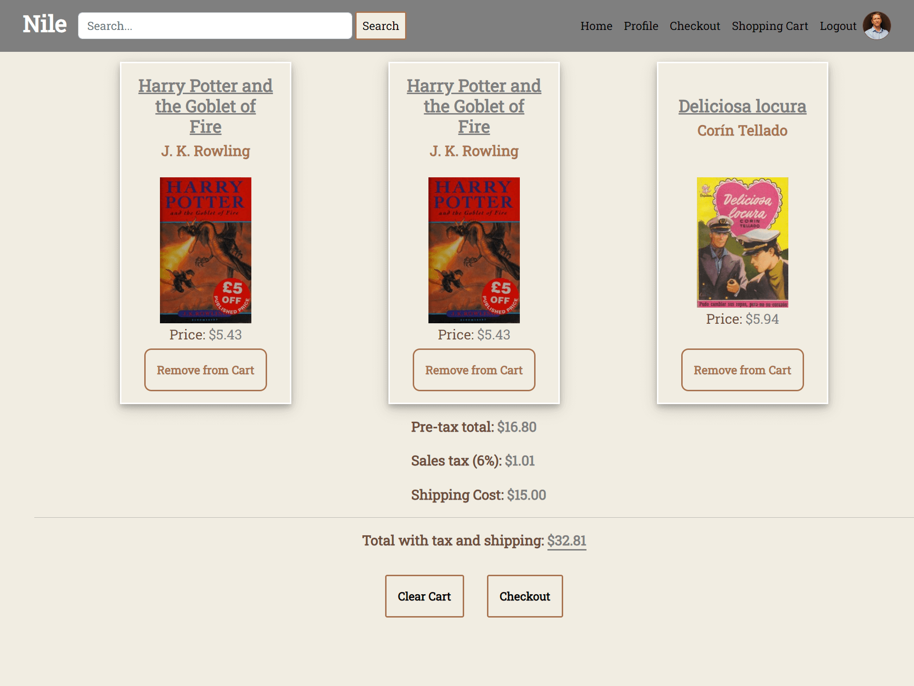
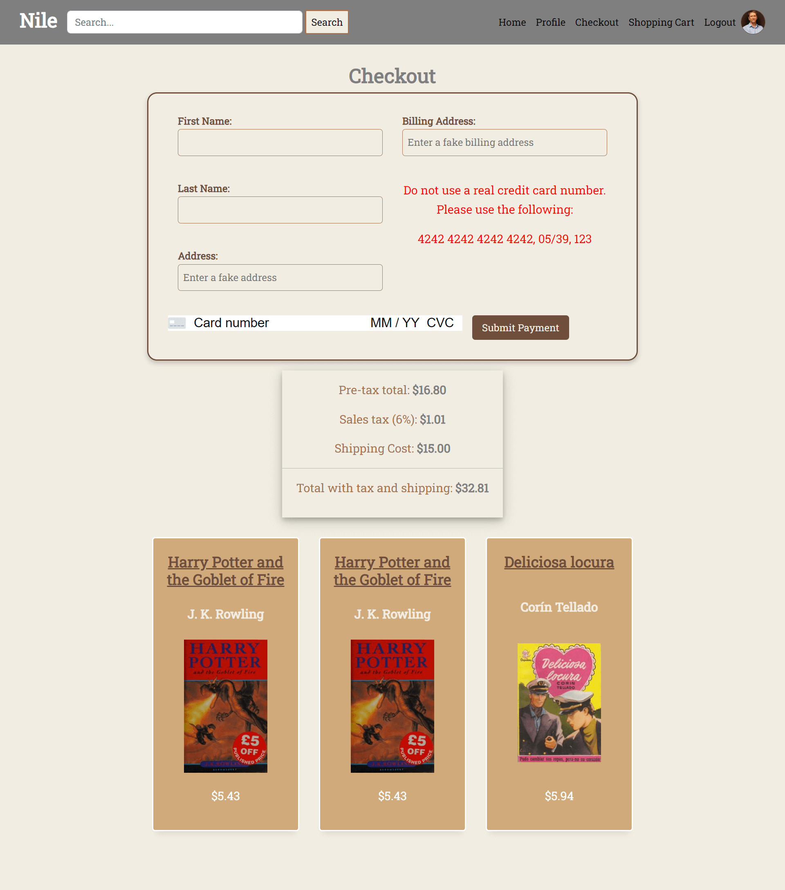
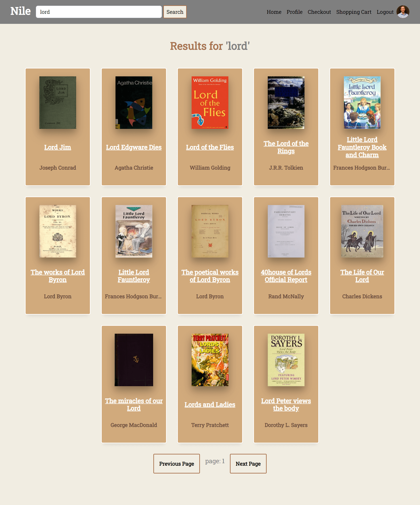

# **Nile**

## **Table of Contents**
- [License](#license)
- [Login Page](#login-page)
- [Shopping Cart](#shopping-cart)
- [Checkout](#checkout)
- [Purpose and Inspiration](#purpose-and-inspiration)
- [Unique Technologies](#unique-technologies)
- [Technologies Used](#technologies-used)
- [Deployment](#Deployment)

## **License**
This project is licensed under the MIT license.

## **Project Overview**
Nile is a state-of-the-art e-commerce platform where book-lovers can explore and 'buy' from a vast range of titles. Each day, users are introduced to an array of 'featured books', providing a dynamic and engaging experience. Nile prioritizes inclusivity and efficiency by adhering to Web Content Accessibility Guidelines (WCAG) and use of semantic HTML. Moreover, Nile ensures secure transactions with Stripe payments and offers personalized user experiences, including profile image upload and order history tracking. Nile is not just an e-commerce platform; it's a testament to how modern web development can merge with user-centric design to create compelling digital experiences.

## **Login Page**

## **Shopping Cart**

Users can select books to add to their shopping cart, where they have the option to review their selection, remove items, or proceed to the checkout page.

## **Checkout**

Using Stripe, the user can enter their fake credit card information and have Stripe take care of the processing. They are then routed to a "Thank You" page with their order number and an option of having a fake email receipt sent to them.

## **Book Results**

The user can view all the books either by category or by title, and select the one that looks most appealing to them.

## **Purpose and Inspiration**
Building Nile was all about getting my hands dirty with the nuts and bolts of an e-commerce website. I wanted to truly understand what happens behind the curtain when we shop online, from managing user interactions to handling secure payment processing and everything in between.

This project wasn't just about learning though; it was a personal challenge. I wanted to push myself and see if I could create a fully-functional, user-friendly platform that could hold its own in the real world. By working on Nile, I had the chance to strengthen my existing skills, learn a bunch of new ones, and grow a deeper appreciation for the craft of web development.

So, at the heart of it all, Nile is a reflection of learning, growth, and a lot of hard work. It's proof that, with a little bit of determination and a lot of coffee, we can create some pretty cool stuff.

## **Unique Technologies**
**Stripe**
Stripe is a renowned global payment processing service known for its seamless and secure digital transactions. By integrating Stripe, we ensured that our platform could handle all the complexities of online payment, from securely storing card information to processing payments in real-time. It's also packed with features such as fraud detection and currency conversion, making it an invaluable tool for any e-commerce project. Notably, Stripe's detailed documentation and React-specific libraries made it a breeze to implement in our tech stack.

**Open Library API**
Open Library API is a freely available, open-source API that provided us access to a vast database of books. By leveraging this API, Nile offers its users a broad selection of titles to browse and purchase. Users can search for books based on different criteria like author name, book title, or subject. The Open Library API is also used for fetching book cover images and other detailed information about each book, enhancing the browsing experience for our users. Its easy-to-use endpoints and comprehensive documentation played a key role in building the book browsing feature of Nile.

## **Technologies Used**
Front End
* React.js
* JavaScript
* CSS
* HTML
* Stripe
* Open Library API

Back End
* MongoDB
* Mongoose ORM
* bcrypt

## **Deployment**
[Deployment Link](https://nile-e-commerce-72580838be73.herokuapp.com/)